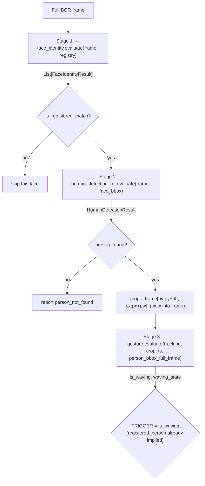
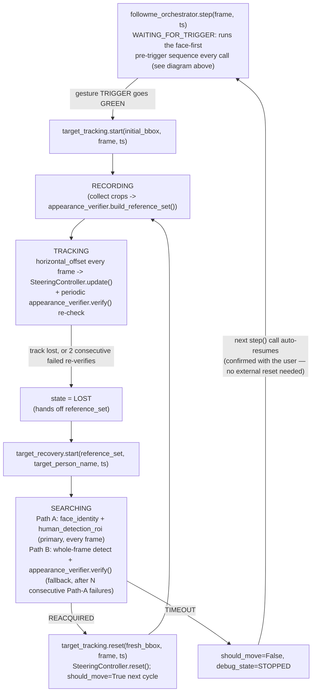
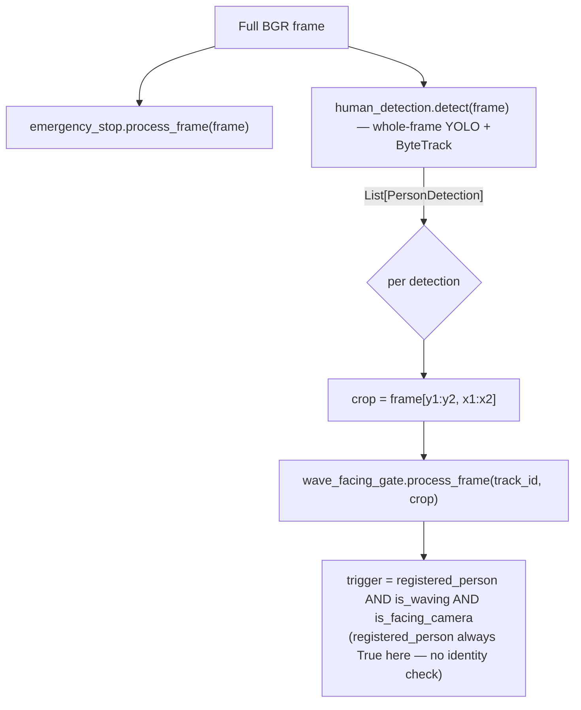

# Architecture

## What this is

A CV pipeline for a "Follow-Me" robot: identify a *specific, pre-registered* person by face,
locate their body, and detect a deliberate hand/arm gesture from them before triggering
follow-mode. Everything runs on-device from a single camera frame — no depth sensor, no
non-CV safety backstop (see [`emergency_stop`](modules.md#emergency_stop)'s note on that).

The codebase is organized as independent, self-contained **modules** (`modules/<name>/`), each
owning its own model instance(s) and state. Two things compose across module boundaries:
[`main.py`](../main.py), the CLI entry point, and `modules/followme_orchestrator/`, the one
module explicitly permitted to do the same thing as a reusable, importable component (see design
rule #2 below for the documented exception). `main.py` can run three unrelated pipelines, chosen
by `--modules`:

- **Legacy pipeline** (`estop` / `wave_facing` / `both`) — the original whole-frame demo: detect
  every person in frame, evaluate wave+facing for each. No identity check.
- **`pretrigger`** — the face-first exploratory pipeline `plans/01-04` describe: find one
  *registered* person by face first, then scope everything downstream to them, **stopping at**
  `TRIGGER = is_waving`. Exists for calibrating/testing the pre-trigger stages in isolation
  (renamed from its original `face_first` name once `followme` below started continuing past
  this same trigger — `plans/01-04` themselves still call the underlying design "face-first").
- **`followme`** — the FULL pipeline (`plans/01-08`): everything `pretrigger` does, continuing
  past the trigger into `modules.followme_orchestrator` — tracking, recovery, PID steering. This
  mode is a thin wrapper in `main.py` around `followme_orchestrator.interface`
  (`configure()`/`step()`); the actual composition logic lives in that module, not here (see
  design rule #2's isolation exception, and [§ Post-trigger
  flow](#post-trigger-flow-tracking-recovery--steering-plans05-08) below).

All three are independent of `emergency_stop`, which is a separate safety layer that can run
alongside the legacy pipeline (`--modules both` runs `estop` + `wave_facing` on the same frame).

## Repository layout

```
main.py                          Entry point — the only file that imports across modules
config/thresholds.yaml           All tunable parameters, one section per module
docs/                            This documentation set
plans/                           Original per-module design specs (01-04)
modules/
  emergency_stop/                Collision-avoidance safety layer (runway + 3-zone STOP logic)
  human_detection/                Whole-frame person detector + ByteTrack (legacy pipeline)
  wave_facing_gate/               Gesture Method 1: MoveNet pose geometry + motion (+ facing-camera gate)
  face_identity/                  Face detect + match against a registered-person database
  human_detection_roi/            ROI-scoped body detector, triggered by a matched face
  gesture_hand_keypoint/          Gesture Method 2: MediaPipe hand-shape sequence classifier
  gesture_trajectory_verifier/    Gesture Method 3: MoveNet wrist/elbow/shoulder trajectory matching
  appearance_verifier/            OSNet Re-ID — "does this crop look like this reference set" (shared dependency of target_tracking + target_recovery)
  target_tracking/                Post-trigger: locks a target, records an appearance reference set, tracks frame-to-frame, reports steering deviation
  target_recovery/                Post-trigger: re-acquires a lost target via face match (primary) or appearance fallback
  followme_orchestrator/          Composes ALL of the above into one steppable step(frame, timestamp) -> FollowMeCommand — see below
```

Each module directory has exactly one importable file, `interface.py` — everything else in that
directory (`pipeline.py`, `config.py`, detector/estimator wrappers, etc.) is a private
implementation detail and may change without notice. This is enforced by convention (each
`interface.py` says so in its docstring), not by Python tooling.

## Design rules (apply across every module)

These are conventions established and repeatedly confirmed over the course of building this
project — they're not incidental, and new code in this repo should follow them.

**1. Fail-closed calibration.** Every module's tunable thresholds live in
`config/thresholds.yaml` and start as `null`. While any required key is `null`, the module
produces its safe/negative output on every call (`GO`→never, `is_waving`→`False`,
`is_registered_match`→`False`, `person_found`→`False`, …) — it never silently guesses a default.
Detection/keypoint extraction itself still runs uncalibrated where possible, specifically so the
module's debug visualization is usable *before* calibration — only the pass/fail verdict is
gated. See [`docs/parameters.md`](parameters.md) for the full status of every key.

**2. Own-instance isolation, and only `main.py` composes across module boundaries.** No module
shares a live model, detector, or tracker instance with another module, even when two modules
use the identical underlying weights file (e.g. `yolo11n.onnx` is loaded independently by
`emergency_stop`, `human_detection`, and `human_detection_roi` — three separate `YOLO(...)`
objects, three separate ByteTrack states). This is a safety/correctness isolation rule, not an
oversight: it means one module's internal state (tracker IDs, confirmation debounce, motion
buffers) can never leak into another's. Ordinarily this also means only `main.py` imports more
than one module's `interface.py` at a time — every module's own `interface.py` docstring says so
explicitly. **`modules/followme_orchestrator/` is the one deliberate, documented exception**
(`plans/08` §0.3): it exists to be the reusable, importable version of what `main.py`'s
`pretrigger` pipeline does ad hoc, extended through tracking/recovery/steering — `main.py`'s own
`followme` mode is just a thin wrapper calling into it, not a second independent implementation.
It still never reaches into any composed module's *private* implementation — only public
`interface.py` contracts, exactly as `main.py` already does. This is a composition-root
exception, not a loophole other modules should also start taking.

**3. The three gesture methods share no code.** `wave_facing_gate` (Method 1),
`gesture_hand_keypoint` (Method 2), and `gesture_trajectory_verifier` (Method 3) are
interchangeable alternatives for the same job (`--gesture-method`) and are independently
implemented end to end — including structurally identical pieces like the RED/YELLOW/GREEN
confirmation debounce, which exists as three separate, near-identical `ConfirmationTracker`
classes rather than one shared import. Only the underlying *models* may be reused (Methods 1 and
3 both use MoveNet Lightning) — never code operating on them.

**4. RED → YELLOW → GREEN confirmation debounce.** A single passing frame is never enough to
trigger anything. Every gated boolean signal in this project (`is_waving`, `is_facing_camera`,
gesture-method completion) is debounced through the same state machine: RED (failing) →
YELLOW (started passing, timing) → GREEN (passed continuously for `confirmation_duration_seconds`)
→ back to RED instantly on any interruption, no partial credit. Only `GREEN` maps to `True`.

**5. Full-frame vs. crop-local pixel space, always explicit.** A person crop is a `numpy` view
into the full frame (`frame[y:y+h, x:x+w]`) — drawing on it mutates `frame` in place, which is
how debug overlays composite. But landmark coordinates from a model run *on that crop* come back
in crop-local pixels, and some gates (the hand-keypoint module's palm-height gate) need to
compare against the person's position in the *full frame*. Every module that needs this does the
conversion explicitly via its own small `BboxContext`-style helper — never assumes crop-local
and full-frame are interchangeable.

**6. Stateless where the coordinate frame can't support state.** `human_detection_roi` derives a
new ROI crop from the matched face's *current* position every single frame — that crop shifts
constantly, which is not a stable coordinate frame for a tracker's motion model (ByteTrack-style
persistence). So it deliberately stays a stateless, single-frame `.predict()` call, keyed by
nothing — downstream modules key their own per-person state off a stable proxy (a hash of the
matched person's *name*, not a track ID) instead.

## Pipeline flow

### face-first pipeline (`--modules pretrigger` / the first half of `--modules followme`)



| Stage | Module call | Input | Output |
|---|---|---|---|
| 1. Face detect + match | [`face_identity.evaluate(frame, registry)`](../modules/face_identity/interface.py) | full BGR frame, `FaceRegistry` | `List[FaceIdentityResult]` — zero, one, or many faces; caller filters to `is_registered_match` |
| 2. ROI-scoped body detection | [`human_detection_roi.evaluate(frame, face_bbox)`](../modules/human_detection_roi/interface.py) | full frame + the matched face's bbox | `HumanDetectionResult(person_found, person_bbox, detection_confidence)` |
| 3. Crop | — | `person_bbox` | `crop = frame[py:py+ph, px:px+pw]` (a view — drawing on it writes through to `frame`) |
| 4. Gesture method (`--gesture-method`) | one of three interchangeable modules, via `_GestureMethodAdapter` in `main.py` | crop + full-frame person bbox + `track_id = hash(matched_person_name)` | `(is_waving, waving_state, extra_debug)` |
| 5. Trigger | — | `is_waving` | `TRIGGER = is_waving` (identity already confirmed in stage 1) |

Human detection never runs on its own in this pipeline — it only ever fires once a face has
already matched a registered person (`plans/02`'s explicit design constraint). Multiple
registered people in the same frame are each evaluated independently; the pipeline does not pick
"the" person.

### Post-trigger flow: tracking, recovery + steering (`plans/05-08`)

Four further modules extend the face-first pipeline past `TRIGGER = is_waving` — each built and
independently testable (its own `test_*.py`/`visualize_*.py`), and composed together into one
steppable pipeline by `modules/followme_orchestrator/` (`plans/08`, the isolation exception
noted in design rule #2 above). `main.py --modules followme` is a thin wrapper around that
composed pipeline; `main.py --modules pretrigger` still stops at the trigger, for calibrating
the pre-trigger stages in isolation. To exercise the FULL flow, either
`python main.py --mode camera --modules followme --gesture-method <method> --show` or
`python -m modules.followme_orchestrator.visualize_followme_orchestrator` directly (the latter
has a richer debug overlay) — see [`commands.md`](commands.md).



- **`target_tracking`** (`modules/target_tracking/`) locks onto the triggering person's bbox,
  records a short set of reference appearance frames (`RECORDING`), then follows them
  frame-to-frame via its own isolated YOLO+ByteTrack instance (`TRACKING`), reporting a
  normalized horizontal deviation from frame-center each frame for downstream steering. A
  periodic `appearance_verifier.verify()` re-check guards against ByteTrack silently
  reassigning the tracked `track_id` to a different nearby person after an occlusion — motion
  continuity alone is never treated as identity confirmation.
- **`target_recovery`** (`modules/target_recovery/`) takes over once `target_tracking` reports
  `LOST`, searching the whole frame to re-acquire the same registered person — face-based first
  (cheap when the face is visible), appearance-based as a fallback (works even facing away/
  occluded, at the cost of `appearance_verifier`'s two accuracy risks).
- **`appearance_verifier`** (`modules/appearance_verifier/`) is the shared OSNet-based capability
  both of the above call into — it holds no state of its own and answers one question only:
  "does this crop match this reference set."
- **`followme_orchestrator`** (`modules/followme_orchestrator/`) is what actually runs the loop
  above — it owns a `SteeringController` (a separate class, deliberately not merged into the
  orchestrator or any CV module — see `docs/modules.md` for the PID-timing rationale) that
  converts `horizontal_offset` into a real steering angle via `camera.fov_degrees`, then PIDs on
  it. `FollowMeCommand.should_move`/`steering_angle_degrees` are the two fields a downstream
  robot-control layer would consume; this project stops at producing that command, not driving
  actual hardware.

See [`docs/modules.md`](modules.md) for each module's full working principle and
[`docs/parameters.md`](parameters.md) for their calibration status.

### Legacy pipeline (`estop` / `wave_facing` / `both`)



`estop` and `wave_facing` are independent of each other even under `--modules both` — both run
on the same frame each iteration, neither's output feeds the other. This is the original
whole-frame demo, with no face/identity verification — `human_detection`'s ByteTrack `track_id`
is motion-continuity only, not a verified identity.

## Entry point (`main.py`)

```
python main.py --mode camera --modules estop
python main.py --mode camera --modules wave_facing --show --debug
python main.py --mode camera --modules pretrigger --gesture-method hand_keypoint --show --debug
python main.py --mode camera --modules followme --gesture-method hand_keypoint --show
python main.py --mode video --video path.mp4 --modules followme --gesture-method trajectory_verifier --show
```

| Flag | Meaning |
|---|---|
| `--mode camera \| video` | Live webcam vs. a recorded file (`--video` required for the latter) |
| `--camera-index N` | OS camera device index; defaults to `config/thresholds.yaml`'s `camera.camera_index`, else `0` |
| `--modules` | `estop` \| `wave_facing` \| `both` (legacy pipeline) \| `pretrigger` (stops at TRIGGER) \| `followme` (full pipeline through steering) |
| `--gesture-method` | `condition` (Method 1) \| `hand_keypoint` (Method 2) \| `trajectory_verifier` (Method 3) — required for `pretrigger`/`followme` |
| `--face-registry-dir` | Path to registered-person `.npz` files (`pretrigger`/`followme` only) |
| `--config` | Path to `thresholds.yaml` (`followme` only — passed to `followme_orchestrator.configure()`) |
| `--show` | Open a display window; without it, everything still runs and prints per-frame status lines, just no window/overlay |
| `--debug` | Enable the full per-phase debug overlay (see below) — only has a visible effect when combined with `--show`. For `pretrigger`: face bbox + ROI region + gesture keypoints/skeleton/state. For `followme`: all of that PLUS `target_tracking`'s bbox/center-line/reverify readout and `target_recovery`'s search status, via `modules.followme_orchestrator.draw_debug()`. |

## Debug/visualization architecture

**Every module that produces a per-frame result exposes `draw_debug()` directly on that result
object** (`FaceIdentityResult.draw_debug(frame)`, `HumanDetectionResult.draw_debug(frame,
matched_face_bbox)`, each `GestureMethodResult.draw_debug(crop, ...)`,
`TrackingResult.draw_debug(frame)`, `RecoveryResult.draw_debug(frame)`) — the module returns
data from `evaluate()`/`update()` as usual, and a *separate*, externally-callable method draws
that same data. No caller needs to reach into a module's private internals or re-implement its
drawing logic to get its debug overlay; every `visualize_*.py` script uses these same methods
rather than hand-rolling the drawing a second time.

Two layers of drawing, composited because `crop`/`frame` are numpy views callers draw directly
onto:

1. **Module-level overlay** (gated by `--debug`, on top of `--show`) — each phase's own
   `draw_debug()`, called in sequence:
   - `pretrigger`: `main.py` calls `face.draw_debug()`, `person.draw_debug()`, then the active
     gesture method's `draw_debug()` (via `_GestureMethodAdapter.draw_debug()`) — face bbox, ROI
     region, person bbox, keypoints/skeleton, gate state, and (Method 2 only) the palm-height
     threshold line and shape-classification coloring.
   - `followme`: `main.py` calls a single `modules.followme_orchestrator.draw_debug(frame)`,
     which internally calls each composed module's `draw_debug()` in turn (the same isolation
     exception that lets it compose their `evaluate()`/`step()` calls) — everything `pretrigger`
     draws, PLUS `TrackingResult.draw_debug()` (bbox, frame-center line, reverify readout) and
     `RecoveryResult.draw_debug()` (search status, reacquired bbox) once past the trigger.
2. **Pipeline-level overlay** (gated by `--show` alone) — `main.py` draws its own bounding
   box/label per person (`pretrigger`) or state/should_move/steering summary text
   (`followme`/legacy), drawn *after* the module overlay so it isn't occluded.

Every module additionally ships its own standalone CLI test/visualization script for isolated
debugging without the rest of the pipeline:

| Module | Script |
|---|---|
| `emergency_stop` | `modules/emergency_stop/test_estop.py` |
| `human_detection` | `modules/human_detection/test_human_detection.py` |
| `wave_facing_gate` | `modules/wave_facing_gate/test_wave_facing.py` |
| `face_identity` | `modules/face_identity/{test_face_identity,visualize_face_identity}.py` |
| `human_detection_roi` | `modules/human_detection_roi/{test_human_detection_roi,visualize_human_detection_roi}.py` |
| `gesture_hand_keypoint` | `modules/gesture_hand_keypoint/{test_gesture_hand_keypoint,visualize_gesture_hand_keypoint}.py` |
| `gesture_trajectory_verifier` | `modules/gesture_trajectory_verifier/{test_gesture_trajectory_verifier,visualize_gesture_trajectory_verifier}.py` |
| `appearance_verifier` | `modules/appearance_verifier/{test_appearance_verifier,visualize_appearance_verifier}.py` |
| `target_tracking` | `modules/target_tracking/{test_target_tracking,visualize_target_tracking}.py` |
| `target_recovery` | `modules/target_recovery/{test_target_recovery,visualize_target_recovery}.py` |
| `followme_orchestrator` | `modules/followme_orchestrator/{test_followme_orchestrator,visualize_followme_orchestrator}.py` — the only tool that exercises the ENTIRE pipeline end-to-end |

`face_identity` also ships a two-phase registration flow, separate from testing:
`capture_face_images.py` (Phase 1 — save padded face crops to `raw_captures/<person>/`) then
`build_face_registry.py` (Phase 2 — re-detect, align, embed, and write `registry_data/<person>.npz`).
Splitting these lets you swap which photos back a registered person without re-running capture.

## See also

- [`docs/technologies.md`](technologies.md) — the concrete tech stack (models, libraries, why each was chosen)
- [`docs/modules.md`](modules.md) — per-module working principles, public contracts, parameters
- [`docs/parameters.md`](parameters.md) — every tunable value, its calibration status, and tuning notes
