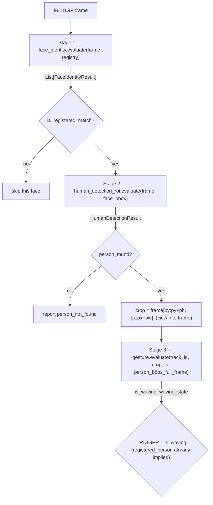
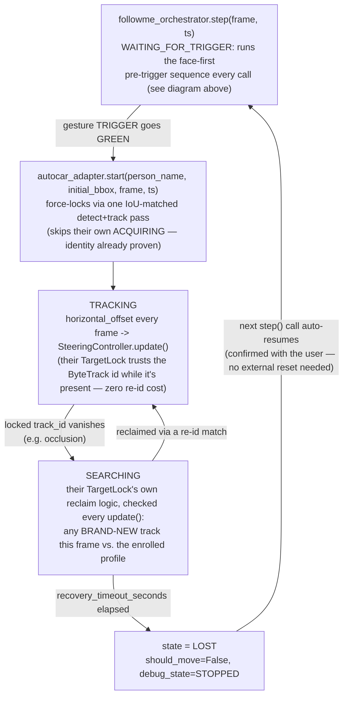
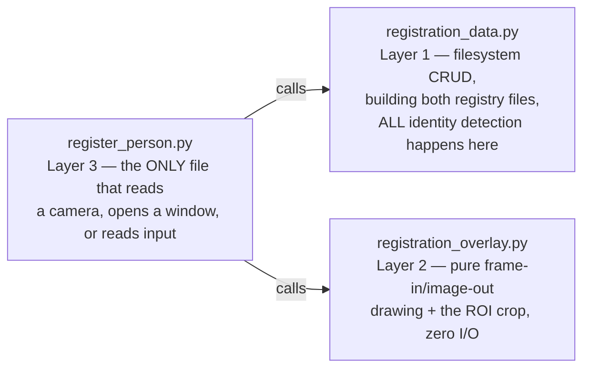

# Architecture

## What this is

A CV pipeline for a "Follow-Me" robot: identify a *specific, pre-registered* person by face,
locate their body, and detect a deliberate hand/arm gesture from them before triggering
follow-mode. Everything runs on-device from a single camera frame — no depth sensor, no
non-CV safety backstop (see [`emergency_stop`](modules.md#emergency_stop)'s note on that).

The codebase is organized as independent, self-contained **modules** (`modules/<name>/`), each
owning its own model instance(s) and state. Two things compose across module boundaries:
[`main.py`](../main.py), the CLI entry point, and `modules/followme_orchestrator/`, the one
module explicitly permitted to do the same thing as a reusable, importable component (see design
rule #2 below for the documented exception). `main.py` can run three unrelated pipelines, chosen
by `--modules`:

- **Legacy pipeline** (`estop` / `wave_facing` / `both`) — the original whole-frame demo: detect
  every person in frame, evaluate wave+facing for each. No identity check.
- **`pretrigger`** — the face-first exploratory pipeline `plans/01-04` describe: find one
  *registered* person by face first, then scope everything downstream to them, **stopping at**
  `TRIGGER = is_waving`. Exists for calibrating/testing the pre-trigger stages in isolation
  (renamed from its original `face_first` name once `followme` below started continuing past
  this same trigger — `plans/01-04` themselves still call the underlying design "face-first").
- **`followme`** — the FULL pipeline (`plans/01-08`): everything `pretrigger` does, continuing
  past the trigger into `modules.followme_orchestrator` — tracking, recovery, PID steering. This
  mode is a thin wrapper in `main.py` around `followme_orchestrator.interface`
  (`configure()`/`step()`); the actual composition logic lives in that module, not here (see
  design rule #2's isolation exception, and [§ Post-trigger
  flow](#post-trigger-flow-tracking-recovery--steering-plans05-08) below).

All three are independent of `emergency_stop`, which is a separate safety layer that can run
alongside the legacy pipeline (`--modules both` runs `estop` + `wave_facing` on the same frame).

## Repository layout

```
main.py                          Entry point — the only file that imports across modules
register_person.py               A second composition root (see below) — the registration UI
registration_data.py             Layer 1 of register_person: filesystem state, CRUD, building
                                  both registry files
registration_overlay.py          Layer 2 of register_person: pure frame-in/image-out drawing
config/thresholds.yaml           All tunable parameters, one section per module
docs/                            This documentation set
plans/                           Original per-module design specs (01-04)
modules/
  emergency_stop/                Collision-avoidance safety layer (runway + 3-zone STOP logic)
  human_detection/                Whole-frame person detector + ByteTrack (also used standalone by
                                   register_person.py to gate the BACK capture phase)
  wave_facing_gate/               Gesture Method 1: MoveNet pose geometry + motion (+ facing-camera gate)
  face_identity/                  Face detect + match against a registered-person database
  human_detection_roi/            ROI-scoped body detector, triggered by a matched face
  gesture_hand_keypoint/          Gesture Method 2: MediaPipe hand-shape sequence classifier
  gesture_trajectory_verifier/    Gesture Method 3: MoveNet wrist/elbow/shoulder trajectory matching
  appearance_verifier/            OSNet Re-ID (shared dependency of target_tracking + target_recovery,
                                   both superseded — see Post-trigger flow below)
  target_tracking/                SUPERSEDED by autocar_adapter (below) — kept until the
                                   replacement is confirmed working, then deleted (docs not updated further)
  target_recovery/                SUPERSEDED by autocar_adapter (below) — same status
  autocar/                        Vendored tracking+recovery backbone (vinhh9608-byte/Autocar,
                                   commit 27ee33a) — YOLOv8-pose + ByteTrack + OSNet TargetLock,
                                   pulled in via `git clone` and kept COMPLETELY UNMODIFIED, not
                                   even a new file added to this directory. See "Post-trigger flow" below.
  followme_orchestrator/          Composes face-first + autocar_adapter (below) into one steppable
                                  step(frame, timestamp) -> FollowMeCommand — see below
```

Each module directory has exactly one importable file, `interface.py` — everything else in that
directory (`pipeline.py`, `config.py`, detector/estimator wrappers, etc.) is a private
implementation detail and may change without notice. This is enforced by convention (each
`interface.py` says so in its docstring), not by Python tooling.

## Design rules (apply across every module)

These are conventions established and repeatedly confirmed over the course of building this
project — they're not incidental, and new code in this repo should follow them.

**1. Fail-closed calibration.** Every module's tunable thresholds live in
`config/thresholds.yaml` and start as `null`. While any required key is `null`, the module
produces its safe/negative output on every call (`GO`→never, `is_waving`→`False`,
`is_registered_match`→`False`, `person_found`→`False`, …) — it never silently guesses a default.
Detection/keypoint extraction itself still runs uncalibrated where possible, specifically so the
module's debug visualization is usable *before* calibration — only the pass/fail verdict is
gated. See [`docs/parameters.md`](parameters.md) for the full status of every key.

**2. Own-instance isolation, and only `main.py` composes across module boundaries.** No module
shares a live model, detector, or tracker instance with another module, even when two modules
use the identical underlying weights file (e.g. `yolo11n.onnx` is loaded independently by
`emergency_stop`, `human_detection`, and `human_detection_roi` — three separate `YOLO(...)`
objects, three separate ByteTrack states). This is a safety/correctness isolation rule, not an
oversight: it means one module's internal state (tracker IDs, confirmation debounce, motion
buffers) can never leak into another's. Ordinarily this also means only `main.py` imports more
than one module's `interface.py` at a time — every module's own `interface.py` docstring says so
explicitly. **`modules/followme_orchestrator/` is the one deliberate, documented exception**
(`plans/08` §0.3): it exists to be the reusable, importable version of what `main.py`'s
`pretrigger` pipeline does ad hoc, extended through tracking/recovery/steering — `main.py`'s own
`followme` mode is just a thin wrapper calling into it, not a second independent implementation.
It still never reaches into any composed module's *private* implementation — only public
`interface.py` contracts, exactly as `main.py` already does. This is a composition-root
exception, not a loophole other modules should also start taking.

`register_person.py` (repo root, alongside `main.py`) is a **second** composition root, for the
same reason `main.py` is one: it composes across `face_identity` and `modules/autocar`'s vendored
code to build both registry files from one capture session — see "Registration UI" below.
`modules/followme_orchestrator/autocar_adapter.py` bridges into `modules/autocar/`'s vendored
tree the same way; it lives inside `followme_orchestrator` rather than inside `modules/autocar/`
specifically so that vendored directory stays a byte-for-byte, untouched mirror of the upstream
clone — not even a new file is ever added there, only read from via `autocar_bootstrap.py`'s
`sys.path` bridge (the same technique their own `scripts/enroll_person.py` uses to reach its own
sibling packages).

**3. The three gesture methods share no code.** `wave_facing_gate` (Method 1),
`gesture_hand_keypoint` (Method 2), and `gesture_trajectory_verifier` (Method 3) are
interchangeable alternatives for the same job (`--gesture-method`) and are independently
implemented end to end — including structurally identical pieces like the RED/YELLOW/GREEN
confirmation debounce, which exists as three separate, near-identical `ConfirmationTracker`
classes rather than one shared import. Only the underlying *models* may be reused (Methods 1 and
3 both use MoveNet Lightning) — never code operating on them.

**4. RED → YELLOW → GREEN confirmation debounce.** A single passing frame is never enough to
trigger anything. Every gated boolean signal in this project (`is_waving`, `is_facing_camera`,
gesture-method completion) is debounced through the same state machine: RED (failing) →
YELLOW (started passing, timing) → GREEN (passed continuously for `confirmation_duration_seconds`)
→ back to RED instantly on any interruption, no partial credit. Only `GREEN` maps to `True`.

**5. Full-frame vs. crop-local pixel space, always explicit.** A person crop is a `numpy` view
into the full frame (`frame[y:y+h, x:x+w]`) — drawing on it mutates `frame` in place, which is
how debug overlays composite. But landmark coordinates from a model run *on that crop* come back
in crop-local pixels, and some gates (the hand-keypoint module's palm-height gate) need to
compare against the person's position in the *full frame*. Every module that needs this does the
conversion explicitly via its own small `BboxContext`-style helper — never assumes crop-local
and full-frame are interchangeable.

**6. Stateless where the coordinate frame can't support state.** `human_detection_roi` derives a
new ROI crop from the matched face's *current* position every single frame — that crop shifts
constantly, which is not a stable coordinate frame for a tracker's motion model (ByteTrack-style
persistence). So it deliberately stays a stateless, single-frame `.predict()` call, keyed by
nothing — downstream modules key their own per-person state off a stable proxy (a hash of the
matched person's *name*, not a track ID) instead.

## Pipeline flow

### face-first pipeline (`--modules pretrigger` / the first half of `--modules followme`)



| Stage | Module call | Input | Output |
|---|---|---|---|
| 1. Face detect + match | [`face_identity.evaluate(frame, registry)`](../modules/face_identity/interface.py) | full BGR frame, `FaceRegistry` | `List[FaceIdentityResult]` — zero, one, or many faces; caller filters to `is_registered_match` |
| 2. ROI-scoped body detection | [`human_detection_roi.evaluate(frame, face_bbox)`](../modules/human_detection_roi/interface.py) | full frame + the matched face's bbox | `HumanDetectionResult(person_found, person_bbox, detection_confidence)` |
| 3. Crop | — | `person_bbox` | `crop = frame[py:py+ph, px:px+pw]` (a view — drawing on it writes through to `frame`) |
| 4. Gesture method (`--gesture-method`) | one of three interchangeable modules, via `_GestureMethodAdapter` in `main.py` | crop + full-frame person bbox + `track_id = hash(matched_person_name)` | `(is_waving, waving_state, extra_debug)` |
| 5. Trigger | — | `is_waving` | `TRIGGER = is_waving` (identity already confirmed in stage 1) |

Human detection never runs on its own in this pipeline — it only ever fires once a face has
already matched a registered person (`plans/02`'s explicit design constraint). Multiple
registered people in the same frame are each evaluated independently; the pipeline does not pick
"the" person.

### Post-trigger flow: tracking, recovery + steering (`plans/05-08`, backbone replaced since)

The face-first pipeline extends past `TRIGGER = is_waving` into tracking/recovery/steering,
composed into one steppable pipeline by `modules/followme_orchestrator/` (`plans/08`, the
isolation exception noted in design rule #2 above). `main.py --modules followme` is a thin
wrapper around that composed pipeline; `main.py --modules pretrigger` still stops at the trigger,
for calibrating the pre-trigger stages in isolation. To exercise the FULL flow, either
`python main.py --gesture-method <method> --show` (via the registration UI's "Follow Me" button,
or `--modules followme` directly) or
`python -m modules.followme_orchestrator.visualize_followme_orchestrator` (the latter has a
richer debug overlay) — see [`commands.md`](commands.md).

The tracking+recovery engine originally spec'd in `plans/06`/`plans/07` (this project's own
`target_tracking`/`target_recovery`, dynamic on-the-fly reference capture, built on
`appearance_verifier`'s OSNet-via-torchreid) has been **replaced** by a teammate's already-built
tracking+recovery backbone (`vinhh9608-byte/Autocar`), vendored unmodified at `modules/autocar/`
and driven by `modules/followme_orchestrator/autocar_adapter.py`. The old modules are still
present (not yet deleted, pending final confirmation the replacement works end-to-end) but are no
longer in the call path — `followme_orchestrator/pipeline.py` calls `autocar_adapter` exclusively.



- **`modules/autocar/`** is their vendored `detector/` (YOLOv8-pose) + `tracker/` (ByteTrack) +
  `identity/` (`TargetLock`, OSNet-based re-id via a local ONNX checkpoint) + `config.py`, pulled
  in with `git clone` at commit `27ee33a` and never edited — not even a new file added to that
  directory. `TargetLock` already conflates tracking-while-present and recovery-on-loss into one
  state machine (its own `ACQUIRING`/`LOCKED` split), so there is no longer a separate recovery
  module or call site — one `autocar_adapter.update()` call does both jobs every frame.
- **`modules/followme_orchestrator/autocar_adapter.py`** is the ONLY file that imports from
  `modules/autocar/`. It force-locks onto the trigger's bbox via one IoU-matched detect+track
  pass at `start()` (skipping their own multi-round `ACQUIRING` face-sampling entirely, since
  `face_identity` + the gesture trigger already proved identity more precisely than that would),
  computes `horizontal_offset` from the tracked bbox each frame (not present in their code at
  all), and wraps their otherwise-indefinite reclaim retry with a `recovery_timeout_seconds`
  timeout (mirrors the old `target_recovery.search_timeout_seconds`'s exact
  `is not None and elapsed >= timeout` convention — `None` means never times out). Also converts
  between this project's `(x, y, w, h)` bbox convention and their `xyxy` one at this one seam.
- **`modules/followme_orchestrator/autocar_bootstrap.py`** puts `modules/autocar/` itself (not
  `modules/`) onto `sys.path` so their own internal absolute imports (`import config`, `from
  detector.base import PoseDetector`, …) resolve — the same bootstrapping technique their own
  `scripts/enroll_person.py` already uses for itself. Safe because nothing else in this project
  ever does a bare `import config`/`import detector`/etc.
- **`followme_orchestrator`** (`modules/followme_orchestrator/`) is what actually runs the loop
  above — it owns a `SteeringController` (a separate class, deliberately not merged into the
  orchestrator or any CV module — see `docs/modules.md` for the PID-timing rationale) that
  converts `horizontal_offset` into a real steering angle via `camera.fov_degrees`, then PIDs on
  it. `FollowMeCommand.should_move`/`steering_angle_degrees` are the two fields a downstream
  robot-control layer would consume; this project stops at producing that command, not driving
  actual hardware. `interface.draw_steering_arrow(frame, command)` draws that calculated
  direction as an arrow from bottom-center of the frame (0° = ahead, +/- = right/left) — the
  actual command, not a per-module debug readout, so it's drawn whenever `--show` is on,
  independent of `--debug`.

`followme_orchestrator.configure()` eagerly loads EVERY model the pipeline will use —
`face_identity` (YuNet+EdgeFace), `human_detection_roi` (YOLO), the chosen gesture method
(MoveNet/MediaPipe), and `autocar_adapter` (YOLO-pose+OSNet, plus one throwaway inference through
each to absorb first-inference backend overhead too) — before it returns (confirmed with the
user: ~3.4s once, at startup, measured end to end). Previously several of these constructed
lazily on first real use; `autocar_adapter`'s detector/embedder in particular only used to build
at the exact moment a gesture trigger fired, which is the worst possible time for a multi-second
stutter. `GestureMethodAdapter.warmup()` and `autocar_adapter.warmup()` are the two new entry
points this relies on.

Registration for `autocar_adapter` requires a **pre-enrolled profile**
(`modules/autocar/models/enrolled_<name>.npz` — front-head, back-of-head, and lower-body OSNet
embeddings + aspect ratio) for whichever person is being followed, unlike the old
`target_tracking`'s on-the-fly reference capture. See "Registration UI" below for how these get
built, and `modules/autocar/models/README.md` for the OSNet ONNX weights `autocar_adapter`
depends on (not part of the vendored repo — exported once via `torchreid`, see
[`technologies.md`](technologies.md)).

See [`docs/modules.md`](modules.md) for each module's full working principle and
[`docs/parameters.md`](parameters.md) for their calibration status.

### Registration UI (`register_person.py` — a second composition root)

Builds the two files `autocar_adapter`/`face_identity` need for a given person, from one capture
session, via three layers (data / overlay / interact — the same separation of concerns as any
MVC-style design, applied here for the first time in this project):



Capture is split into two persisted, inspectable phases, not one — **RAW** (the exact camera
frame, no cropping) then **CROPPED** (`registration_data.build_cropped_roi()` reads the RAW files
back and crops each to the operator-configured ROI, saving the result as its own file you can open
and check before anything downstream ever runs on it). The Tkinter flow (`CaptureWindow`)
genuinely pauses after cropping with an OK/Cancel dialog for exactly this reason. ALL IDENTITY
detection — face detection for the face registry, pose/person detection for the re-id profile
(picking the LARGEST bbox in each cropped image, then splitting head/lower) — happens only in the
third phase, `registration_data.build_face_registry()`/`build_target_profile()`, reading the
CROPPED images, never live during capture.

RAW capture itself does run one lightweight, non-identity check live: `registration_data.
LiveSubjectDetector` counts how many people have a bbox center inside the ROI each throttled tick
(mirroring `modules/autocar/scripts/enroll_person.py`'s own live per-frame gate) — a frame is only
accepted and saved when that count is exactly 1, and the ROI box is drawn green/yellow to match
(accepted/rejected). This closes a gap the max-bbox pick in `build_target_profile()` couldn't:
without it, a second person passing through the ROI during capture could get silently embedded if
their bbox happened to be larger than the actual subject's.

FRONT feeds both consumers (face registry + the re-id profile's front-head/lower-body
embeddings); BACK feeds only the re-id profile's back-of-head embedding. A fresh session
(`registration_data.reset_captures()`) always wipes previous RAW+CROPPED photos first — Create
and Update never mix old and new photos — but the already-built `.npz` files are only overwritten
once a rebuild actually succeeds, so a failed session never destroys the last known-good profile.

`register_person.py RegistrationApp` (Tkinter — no args) is the primary CRUD interface: New /
Re-capture / Delete / Refresh, plus a "Follow Me" button that hands a fully-registered person's
name back to `main.py` (via `RegistrationApp.chosen_name`) to fall through directly into the same
`followme` camera loop `--then-followme` uses. `register_person.run()` is the same flow headless
(plain cv2 window, no Tkinter) for scripted/one-person use — both `main.py --modules register
--person-name <name>` and standalone `python register_person.py <name>` call it directly.

## Entry point (`main.py`)

The original whole-frame `estop`/`wave_facing`/`both` demo pipeline (no face/identity
verification) has been removed from `main.py` — the face-first pipelines below fully superseded
it.

```
python main.py
    # --modules defaults to "register" — opens the Tkinter registration UI (see above)
python main.py --gesture-method hand_keypoint --show
    # same, but the UI's "Follow Me" button can now hand off into followme mode
python main.py --mode camera --modules pretrigger --gesture-method hand_keypoint --show --debug
python main.py --mode camera --modules followme --gesture-method hand_keypoint --show
python main.py --mode video --video path.mp4 --modules followme --gesture-method trajectory_verifier --show
python main.py --modules register --person-name Nam --then-followme --gesture-method hand_keypoint --show
```

| Flag | Meaning |
|---|---|
| `--mode camera \| video` | Live webcam vs. a recorded file (`--video` required for the latter); required for `pretrigger`/`followme`, ignored/not required for `register` |
| `--camera-index N` | OS camera device index; defaults to `config/thresholds.yaml`'s `camera.camera_index`, else `0` |
| `--modules` | `pretrigger` (stops at TRIGGER) \| `followme` (full pipeline through steering) \| `register` (**default**) — hands off to `register_person`, not a per-frame pipeline |
| `--gesture-method` | `condition` (Method 1) \| `hand_keypoint` (Method 2) \| `trajectory_verifier` (Method 3) — required for `pretrigger`/`followme`; only required for `register` if you intend to use `--then-followme` or the UI's "Follow Me" button |
| `--face-registry-dir` | Path to registered-person `.npz` files (`pretrigger`/`followme` only) |
| `--config` | Path to `thresholds.yaml` — passed to `followme_orchestrator.configure()` (`followme`) or `register_person.run()` (`register`) |
| `--person-name` | `register` only: headless single-person registration, no UI. Omit to open the Tkinter UI instead. |
| `--front-samples` / `--back-samples` | `register` only: sample counts per capture phase (default 15 each) |
| `--then-followme` | `register --person-name` (headless) only: on success, fall through into the same `followme` camera loop, no second command |
| `--show` | Open a display window; without it, everything still runs and prints per-frame status lines, just no window/overlay |
| `--debug` | Enable the full per-phase debug overlay (see below) — only has a visible effect when combined with `--show`. For `pretrigger`: face bbox + ROI region + gesture keypoints/skeleton/state. For `followme`: all of that PLUS `autocar_adapter`'s tracked bbox/center-line/state readout, via `modules.followme_orchestrator.draw_debug()`. The steering-direction arrow is separate from `--debug` — see below. |

## Debug/visualization architecture

**Every module that produces a per-frame result exposes `draw_debug()` directly on that result
object** (`FaceIdentityResult.draw_debug(frame)`, `HumanDetectionResult.draw_debug(frame,
matched_face_bbox)`, each `GestureMethodResult.draw_debug(crop, ...)`,
`autocar_adapter.TrackingResult.draw_debug(frame)`) — the module returns data from
`evaluate()`/`update()` as usual, and a *separate*, externally-callable method draws that same
data. No caller needs to reach into a module's private internals or re-implement its drawing
logic to get its debug overlay; every `visualize_*.py` script uses these same methods rather than
hand-rolling the drawing a second time.

Separately, `modules.followme_orchestrator.interface.draw_steering_arrow(frame, command)` draws
the CALCULATED direction the robot is being told to move — an arrow from bottom-center of the
frame, 0° = straight ahead, positive = right, negative = left (the exact sign convention
`SteeringController` already uses). This is not a per-module debug overlay (it's not gated by
`--debug`) — it's the actual robot command for this frame, so it's drawn whenever `--show` is on,
and no-ops entirely while `should_move` is `False`.

Two layers of drawing, composited because `crop`/`frame` are numpy views callers draw directly
onto:

1. **Module-level overlay** (gated by `--debug`, on top of `--show`) — each phase's own
   `draw_debug()`, called in sequence:
   - `pretrigger`: `main.py` calls `face.draw_debug()`, `person.draw_debug()`, then the active
     gesture method's `draw_debug()` (via `_GestureMethodAdapter.draw_debug()`) — face bbox, ROI
     region, person bbox, keypoints/skeleton, gate state, and (Method 2 only) the palm-height
     threshold line and shape-classification coloring.
   - `followme`: `main.py` calls a single `modules.followme_orchestrator.draw_debug(frame)`,
     which internally calls each composed module's `draw_debug()` in turn (the same isolation
     exception that lets it compose their `evaluate()`/`step()` calls) — everything `pretrigger`
     draws, PLUS `autocar_adapter.TrackingResult.draw_debug()` (tracked bbox, frame-center line,
     state readout) once past the trigger.
2. **Pipeline-level overlay** (gated by `--show` alone) — `main.py` draws its own bounding
   box/label per person (`pretrigger`) or state/should_move/steering summary text +
   `draw_steering_arrow()` (`followme`), drawn *after* the module overlay so it isn't occluded.

Every module additionally ships its own standalone CLI test/visualization script for isolated
debugging without the rest of the pipeline:

| Module | Script |
|---|---|
| `emergency_stop` | `modules/emergency_stop/test_estop.py` |
| `human_detection` | `modules/human_detection/test_human_detection.py` |
| `wave_facing_gate` | `modules/wave_facing_gate/test_wave_facing.py` |
| `face_identity` | `modules/face_identity/{test_face_identity,visualize_face_identity}.py` |
| `human_detection_roi` | `modules/human_detection_roi/{test_human_detection_roi,visualize_human_detection_roi}.py` |
| `gesture_hand_keypoint` | `modules/gesture_hand_keypoint/{test_gesture_hand_keypoint,visualize_gesture_hand_keypoint}.py` |
| `gesture_trajectory_verifier` | `modules/gesture_trajectory_verifier/{test_gesture_trajectory_verifier,visualize_gesture_trajectory_verifier}.py` |
| `appearance_verifier` | `modules/appearance_verifier/{test_appearance_verifier,visualize_appearance_verifier}.py` — no longer in the live call path (see Post-trigger flow) but still standalone-runnable |
| `target_tracking` | `modules/target_tracking/{test_target_tracking,visualize_target_tracking}.py` — SUPERSEDED, same status |
| `target_recovery` | `modules/target_recovery/{test_target_recovery,visualize_target_recovery}.py` — SUPERSEDED, same status |
| `autocar` (vendored) | `modules/autocar/main.py --target modules/autocar/models/enrolled_<name>.npz` — THEIR OWN standalone demo, exercises their tracking+recovery engine directly against one enrolled profile, entirely independent of `autocar_adapter`/`followme_orchestrator` (must be run with `modules/autocar/` as the working directory — their internal paths are relative to it) |
| `followme_orchestrator` | `modules/followme_orchestrator/{test_followme_orchestrator,visualize_followme_orchestrator}.py` — the only tool that exercises the ENTIRE pipeline end-to-end |

`face_identity` also ships a two-phase registration flow, separate from testing:
`capture_face_images.py` (Phase 1 — save padded face crops to `raw_captures/<person>/`) then
`build_face_registry.py` (Phase 2 — re-detect, align, embed, and write `registry_data/<person>.npz`).
Splitting these lets you swap which photos back a registered person without re-running capture.

## See also

- [`docs/technologies.md`](technologies.md) — the concrete tech stack (models, libraries, why each was chosen)
- [`docs/modules.md`](modules.md) — per-module working principles, public contracts, parameters
- [`docs/parameters.md`](parameters.md) — every tunable value, its calibration status, and tuning notes
