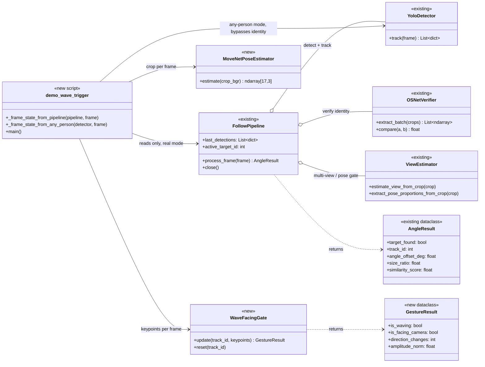
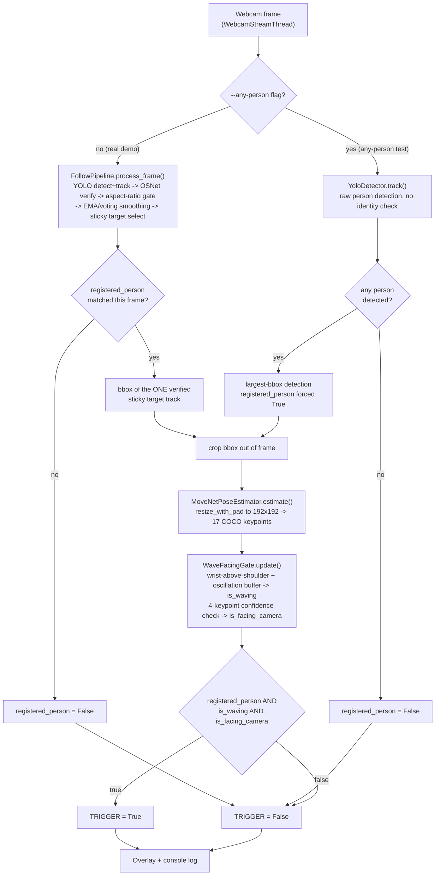

# Architecture

This document covers the whole `UOG_AIS_FOLLOWME` system as it stands after the Quick Demo
Spec work (Wave + Facing Trigger Gate), split into the **existing Follow-Me pipeline**
(unmodified) and the **new demo layer** built on top of it.

## Layers

```
┌─────────────────────────────────────────────────────────────────────┐
│  Entry points                                                        │
│  main.py (capture / register / run)      demo_wave_trigger.py (new)  │
└───────────────┬───────────────────────────────────┬──────────────────┘
                │                                   │
                ▼                                   ▼
┌───────────────────────────────┐   ┌─────────────────────────────────┐
│ Stage 1 — Registration         │   │ Demo layer (NEW)                │
│ src/registration.py            │   │ src/pose_estimator.py           │
│ src/registry.py                │   │ src/wave_detector.py            │
│ src/person_selector.py         │   │ (reads pipeline output only)    │
└───────────────┬─────────────────┘  └───────────────┬──────────────────┘
                │ .npz reference                     │ crop + AngleResult
                ▼                                    │
┌─────────────────────────────────────────────────────┴────────────────┐
│ Stage 2 — Follow-Me pipeline (src/pipeline.py, UNMODIFIED)            │
│  src/detector.py (YOLO11 + ByteTrack)                                │
│  src/verifier.py (OSNet re-id)                                       │
│  src/view_estimator.py (multi-view + pose-proportions gate)          │
│  src/types.py (AngleResult)                                          │
└─────────────────────────────────────────────────────────────────────┘
```

## Existing components (not modified by this work)

| Component | File | Responsibility |
|---|---|---|
| `WebcamStreamThread` | `main.py` | Non-blocking threaded camera reader; reused by `demo_wave_trigger.py` via import. |
| `RawDataCapturer` / `TargetRegistrar` | `src/registration.py` | Phase 1 (raw capture) + Phase 2 (build reference embedding/aspect-ratio/pose-proportions) for one person. |
| `PersonRegistrySelector` | `src/person_selector.py` | Tkinter GUI to pick (or register) which person to follow this session. |
| registry functions | `src/registry.py` | Load/save/list/rename/delete `.npz` reference files under `logs/registry/`. |
| `YoloDetector` | `src/detector.py` | Ultralytics YOLO11 person detection + ByteTrack multi-object tracking (`track_id`, `bbox`, `confidence`). |
| `OSNetVerifier` | `src/verifier.py` | OSNet re-id embedding extraction + cosine-similarity comparison against the registered reference. |
| `ViewEstimator` | `src/view_estimator.py` | YOLO-pose-based body-orientation classification (front/right/back/left) and pose-proportion similarity, used inside verification. |
| `FollowPipeline` | `src/pipeline.py` | Orchestrates the above: per-frame detect → verify → aspect-ratio gate → temporal smoothing (EMA/voting) → sticky single-target selection → `AngleResult`. |
| `AngleResult` | `src/types.py` | Dataclass: `target_found`, `track_id`, `angle_offset_deg`, `size_ratio`, `similarity_score`. |
| `render()` | `src/debug_overlay.py` | Debug UI for `main.py --ui` (bboxes, ROI, telemetry) — unrelated to the demo overlay. |

**Key invariant relied on by the demo:** `FollowPipeline.process_frame()` always resolves to at
most **one** active/verified target per frame (`AngleResult.track_id`) — confirmed by reading
`process_frame()`'s sticky-target selection logic, not assumed. This is why the demo never needs
to handle "multiple verified people in frame" as a case.

## New components (Quick Demo Spec: Wave + Facing Trigger Gate)

| Component | File | Responsibility |
|---|---|---|
| `MoveNetPoseEstimator` | `src/pose_estimator.py` | Wraps MoveNet Lightning (loaded from TF Hub), runs on a single-person crop, returns `(17, 3)` COCO keypoints `[y, x, confidence]`. |
| `WaveFacingGate` / `GestureResult` | `src/wave_detector.py` | Per-track wave detector (wrist-above-shoulder posture + wrist-x oscillation over a rolling buffer, with bad-frame fault tolerance) and 4-keypoint facing-camera proxy. |
| `demo_wave_trigger.py` | project root | Entry script. Two modes sharing one downstream pipeline (crop → MoveNet → gate → trigger → overlay): <br>• **real mode** (default): sources `registered_person`/bbox from `FollowPipeline` (identity-verified). <br>• **`--any-person`**: bypasses identity entirely, uses `YoloDetector` directly, picks the largest-bbox detected person — for testing the gesture/pose logic without registering anyone. |

See [diagrams/class_diagram.mmd](diagrams/class_diagram.mmd) and
[diagrams/flow_diagram.mmd](diagrams/flow_diagram.mmd) for the visual versions (also rendered in
the companion Artifact).

## Class diagram



## Per-frame flow diagram



## Why the two modes share one downstream path

The only thing that differs between real mode and `--any-person` mode is **how
`registered_person`/`track_id`/`bbox` get sourced** (identity-verified sticky target vs. raw
largest-bbox detection). Everything after "crop bbox out of frame" — MoveNet, the wave/facing
gate, the trigger formula, the overlay — is the exact same code path (`_frame_state_from_*()`
functions return a common `(bool, Optional[int], Optional[bbox])` tuple consumed identically).
This keeps the any-person testing mode from silently drifting away from the real demo's gesture
logic.
